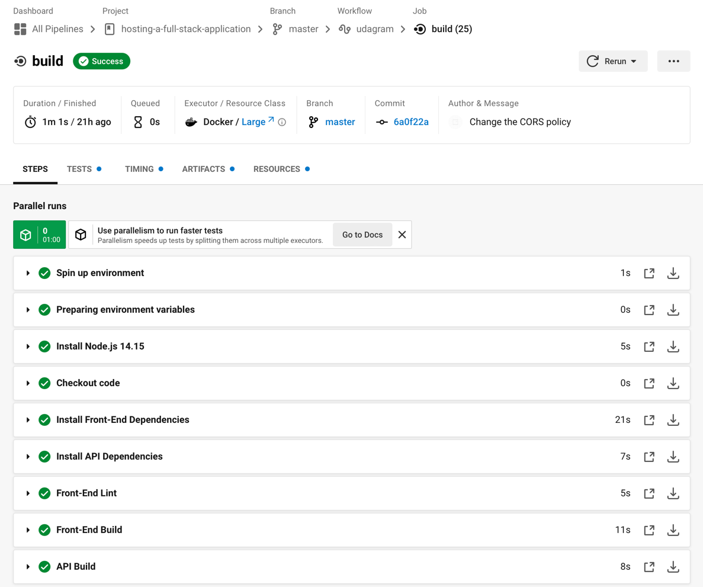
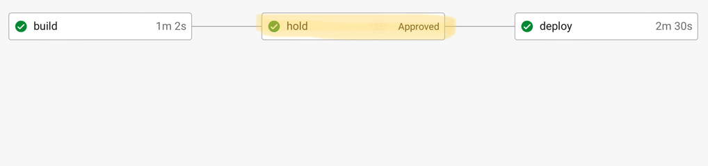
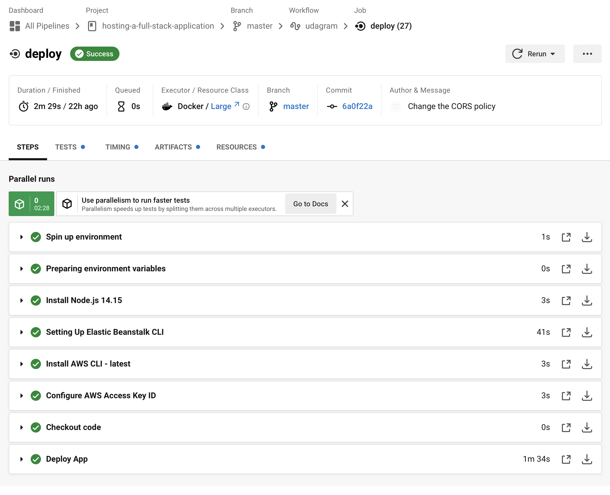

# Pipeline Process

Udagram utilizes a [CircleCi](https://circleci.com/) CI/CD pipeline for deploying the application.

## Pipeline Flow Diagram

### 1. Build Steps

- Spin up environment.
- Preparing environment variables.
- Install Node.js 14.15.
- Checkout code.
- Install Front-End Dependencies.
- Install API Dependencies.
- Front-End Lint.
- Front-End Build.
- API Build.

### 2. Manual Approval

This step needs to be taken by a human who has access to the CircleCi dashboard.

### 3. Deploy Steps

- Spin up environment.
- Preparing environment variables.
- Install Node.js 14.15.
- Setting Up Elastic Beanstalk CLI.
- Install AWS CLI - latest.
- Configure AWS Access Key ID.
- Checkout code.
- Deploy App.

